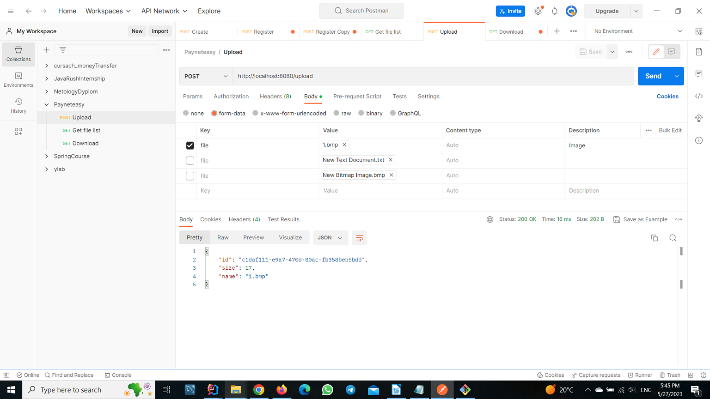
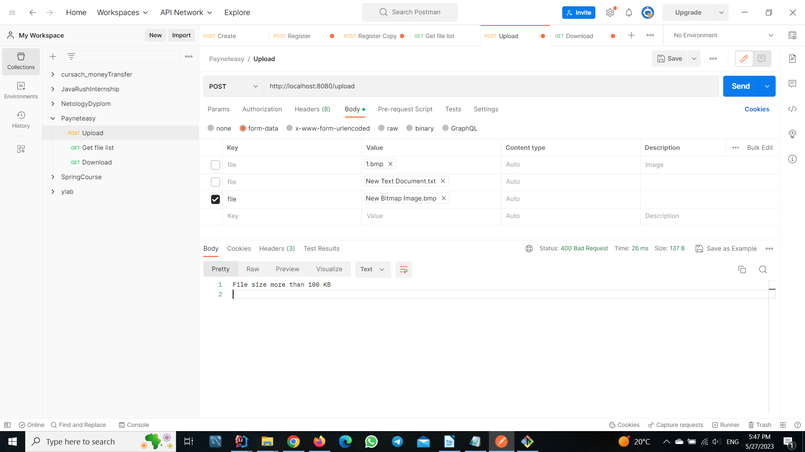
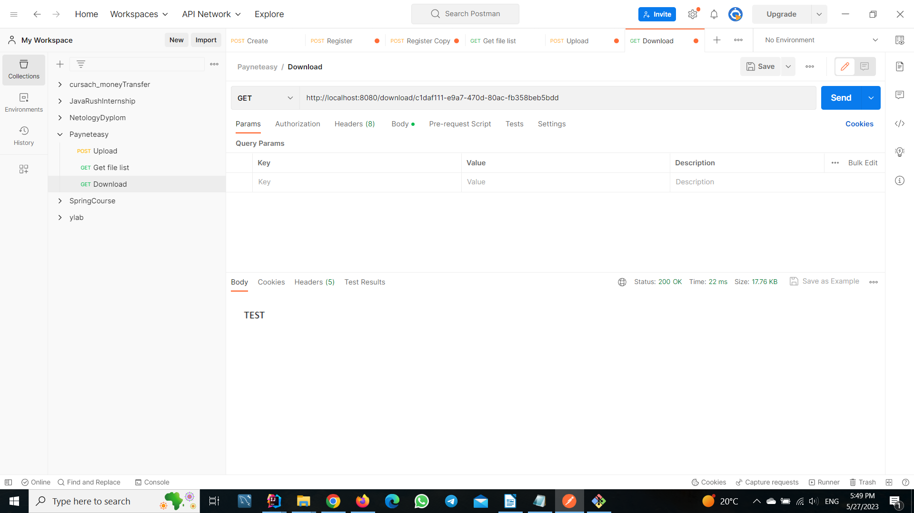
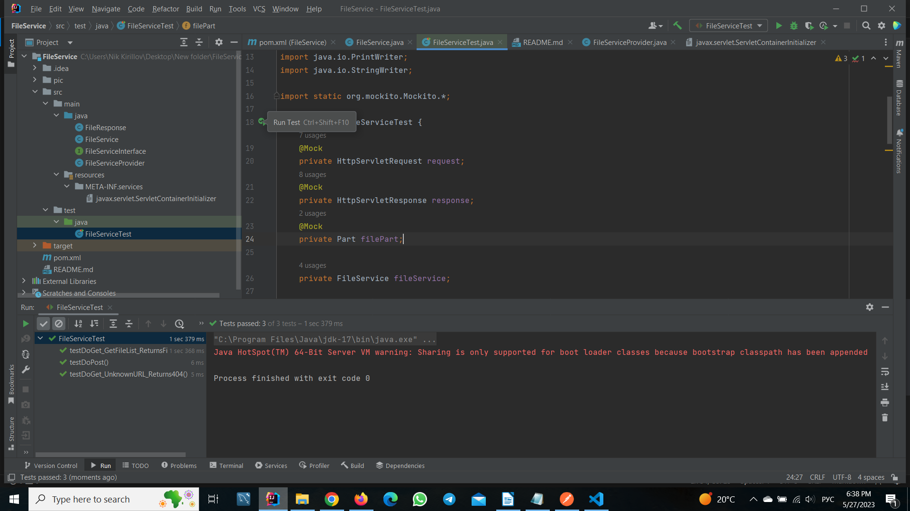

## Описание запуска веб-сервера, проверки работы API в Postman и запуска тестов.

- Для того чтобы запустить проект, в папке проекта `FileService` выполните команду `mvn jetty:run` в командной строке. `Maven` автоматически загрузит все зависимости, скомпилирует исходный код и запустит сервер `Jetty` с веб-приложением.

#### Рис.1 Запуск сервера

  
- Для тестов API можно использовать Postman.

#### Рис.2 Завершенный POST-запрос на добавление файла

  

#### Рис.3 Незавершенный POST-запрос на добавление файла (превышен размер файла)

  

#### Рис.4 Незавершенный POST-запрос на добавление файла (разрешение файла .txt или .csv)

  

#### Рис.5 GET-запрос (список файлов)

  

#### Рис.6 GET-запрос (загрузить файл)

  
- Для запуска программных тестов запустите IntelliJ IDEA и запустите тесты.

#### Рис.7 Запуск тестов