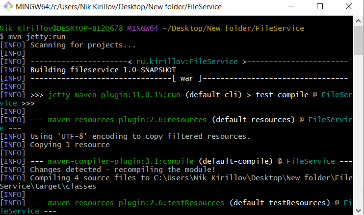

## Задание

Написать веб-сервис для работы с файлами:  
- Веб-сервер реализовать на Jetty (Embedded Mode).
- Реализовать API методы через Servlet API для работы с файлами.

1) Загрузка файла.  
Ограничения:
- Размер файла не больше 100 кб.
- Пропускать файлы с расширением .txt и .csv.  
Request: POST /upload  
Response:  
Content-type: application/json  
{  
id: <FILE_ID>  
size: <FILE_SIZE_KB>  
name:  <FILE_NAME>  
} 

2) Скачивание файла:  
Request: GET /download/<FILE_ID>

3) Получение списка файлов:  
Request GET /files  
Content-type: application/json  
[{  
id: <FILE_ID>  
size: <FILE_SIZE_KB>  
name:  <FILE_NAME>  
}]

- Для каждого метода API, включая ограничения, написать тесты.

- Модуль для работы с файлами реализовать через Service Provider Interface (SPI) механизм. Для примера, разработать хранение в файловой системе.

Требования к технологиям:
- Java 17 и выше
- Servlet API
- Web server - Jetty 
- Сторонние библиотеки, например Gson и т.д.
- Сборка проекта - maven

## Описание запуска веб-сервера, проверки работы API в Postman и запуска тестов.

- Для того чтобы запустить проект, в папке проекта `FileService` выполните команду `mvn jetty:run` в командной строке. `Maven` автоматически загрузит все зависимости, скомпилирует исходный код и запустит сервер `Jetty` с веб-приложением.

#### Рис.1 Запуск сервера

  
- Для тестов API можно использовать Postman.

#### Рис.2 Завершенный POST-запрос на добавление файла

  

#### Рис.3 Незавершенный POST-запрос на добавление файла (превышен размер файла)

  

#### Рис.4 Незавершенный POST-запрос на добавление файла (разрешение файла .txt или .csv)

  

#### Рис.5 GET-запрос (список файлов)

  

#### Рис.6 GET-запрос (загрузить файл)

  
- Для запуска программных тестов запустите IntelliJ IDEA и запустите тесты.

#### Рис.7 Запуск тестов